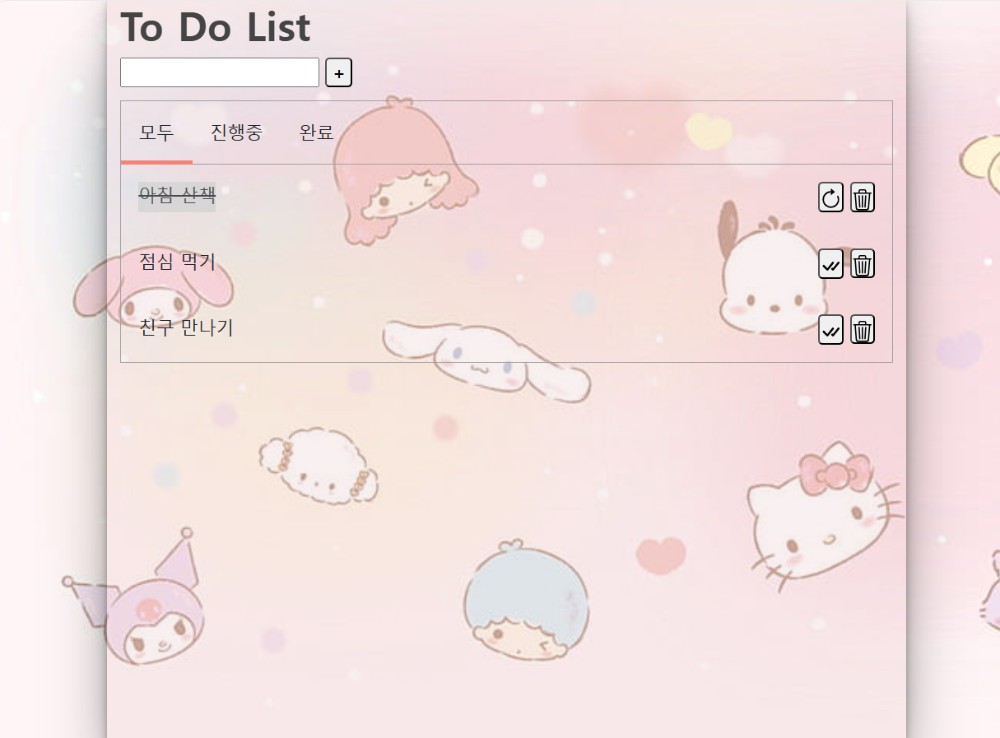
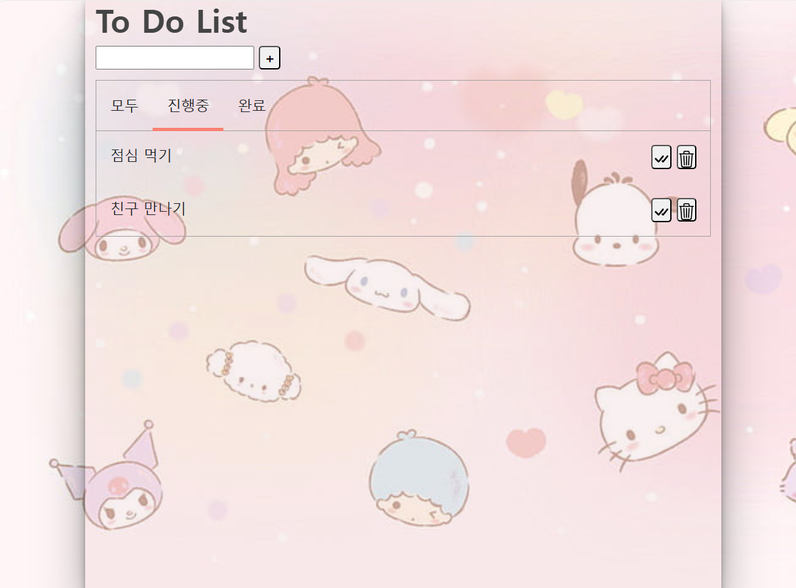
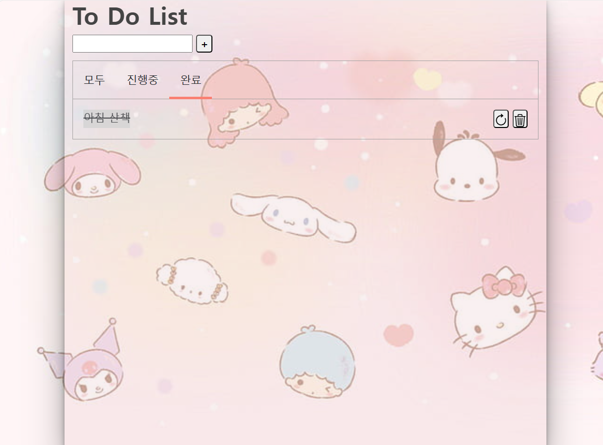

# To-Do-List 📝
Javascript를 이용하여 간단한 To-Do-List 만들기 

 

## 설계 순서 ✔
1) 할 일을 인풋창에 입력
2) 추가 버튼 (+)
   - 아이템이 누적됨 (할 일 추가)
   - 엔터키 눌러도 추가 가능
3) 삭제 버튼 (🗑 버튼)
4) 체크 버튼
   - 할 일이 완료되고, 줄이 그어짐
5) 진행중, 완료 탭을 누르면 언더바가 이동됨
6) 각각의 탭들을 구분
   - 완료 탭 -> 완료 아이템만 보여줌
   - 진행중 탭 -> 진행 중인 아이템만 보여줌
   - 모두 탭 -> 전체 아이템을 보여줌
     
 

## 미리보기 👀
##### [ALL]
</img>

##### [ONGOING]
</img>

##### [DONE]
</img>

